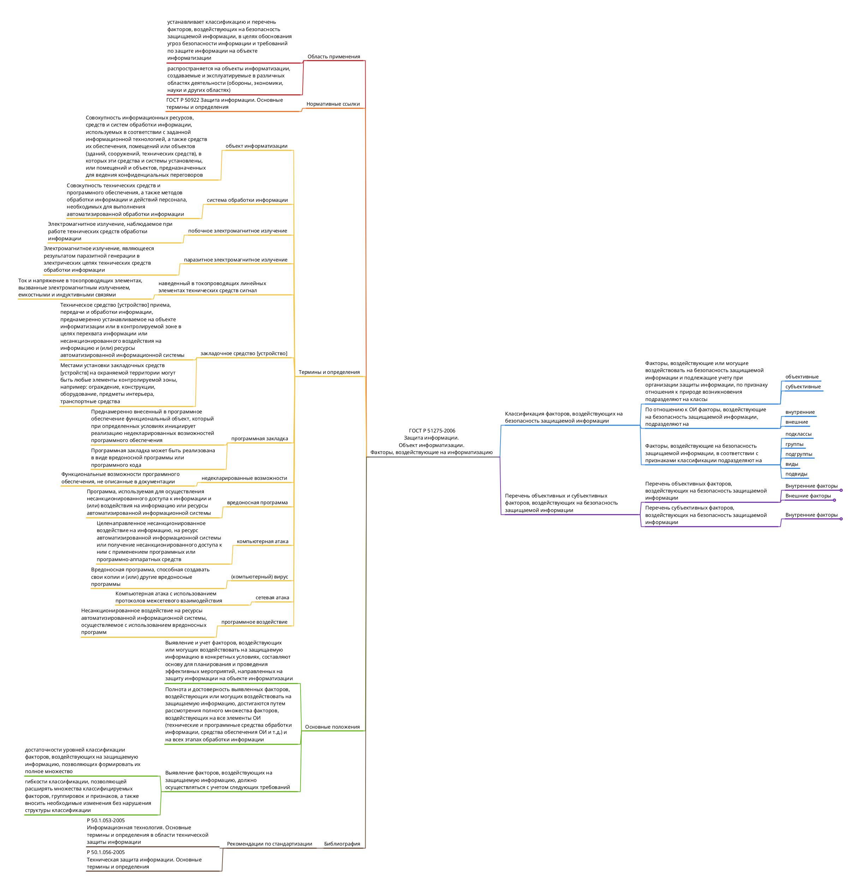

# Создание ментальной карты

## Цель работы

1.  Изучить международные и российские стандарты, связанные с
    информационной безопасностью

2.  Получить навыки систематизации информации с помощью ментальной карты

## Исходные данные

1.  ОС Windows 10

2.  Freeplane

3.  ГОСТ Р 51275-2006 “Защита информации. Объект информатизации.
    Факторы, воздействующие на информатизацию”

## Ход выполнения практической работы

С [веб-ресурса “Электронный фонд правовых и нормативно-технических
документов”](https://docs.cntd.ru/document/1200057516) был скачан текст
стандарта ГОСТ Р 51275-2006 “Защита информации. Объект информатизации.
Факторы, воздействующие на информатизацию”.

Далее, с помощью программы Freeplane была создана ментальная карта:

## Оценка результата

В ходе выполнения практической работы была создана ментальная карта
(файл mindmap.mm) по стандарту ГОСТ Р 51275-2006 “Защита информации.
Объект информатизации. Факторы, воздействующие на информатизацию”.

## Выводы

Таким образом, с помощью ментальной карты удалось систематизировать
информацию о стандарте в удобном для чтения виде.
